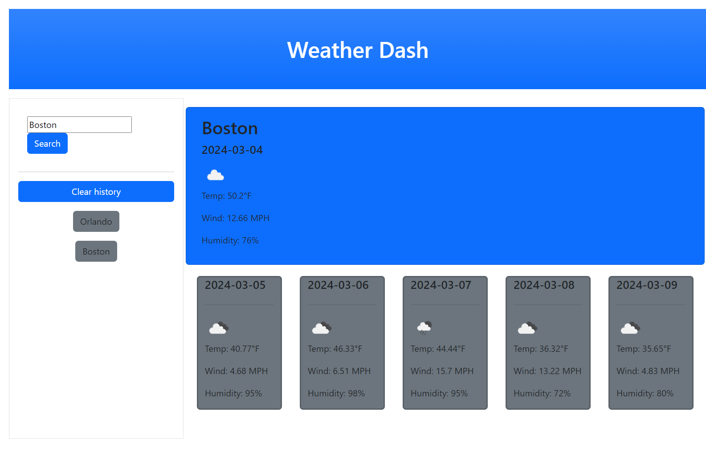

# Weather Dash

## Daily weather dashboard + 5-day forecast

This web page enables the user to search for weather information for a given location.

They will also get a 5-day forecast.

Any location they search for will be saved as a quick search button that is retained across visits.

# Installation

N/A

# Usage

The web page can currently be found hosted on Github [here](https://stephen-bates.github.io/Weather-Dash/)

The page should resemble the image below:

## Credits

All HTML, CSS, and Javascript is entirely original and designed by myself

## Liscense

N/A